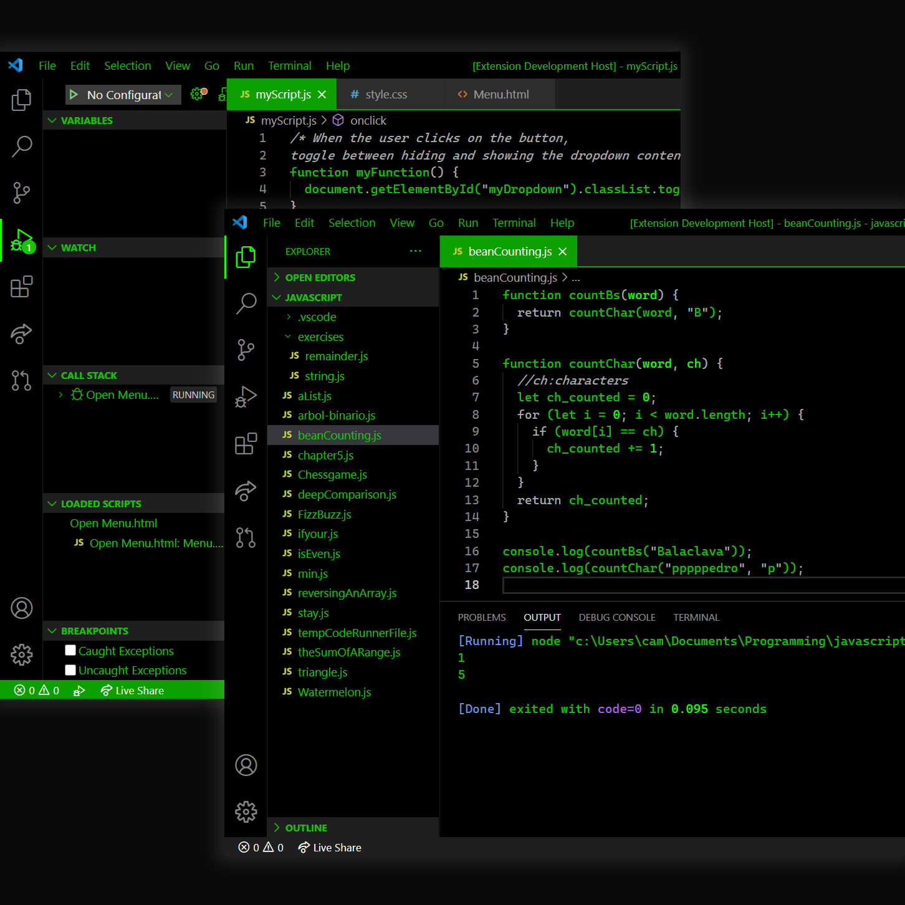

# Pro Hacker Theme for [Visual Studio Code](https://marketplace.visualstudio.com/)

VS Code Theme made for pro hackers. But no really, simple black and green theme to make you feel like a hacker while you write poor code. :computer:

## Screenshot :camera:

## Instalation

This theme is available in the [Visual Studio Code Marketplace](https://marketplace.visualstudio.com/items?itemName=CamilaMartinezBedoya.pro-hacker-theme&ssr=false#overview)

1. Install the extension
2. Go to **View -> Command Palette**
3. Write **Preferences: Color Theme** and press **Enter**
4. Find the theme **Pro Hacker Theme**, press **Enter** and you are done!

## Author :eyes:

Camila Martínez Bedoya

- [Instagram](https://www.instagram.com/cam.codes)
- [LinkedIn](https://www.linkedin.com/in/camila-martinez-5b43011a2/)

**Enjoy coding like a pro hacker!**
